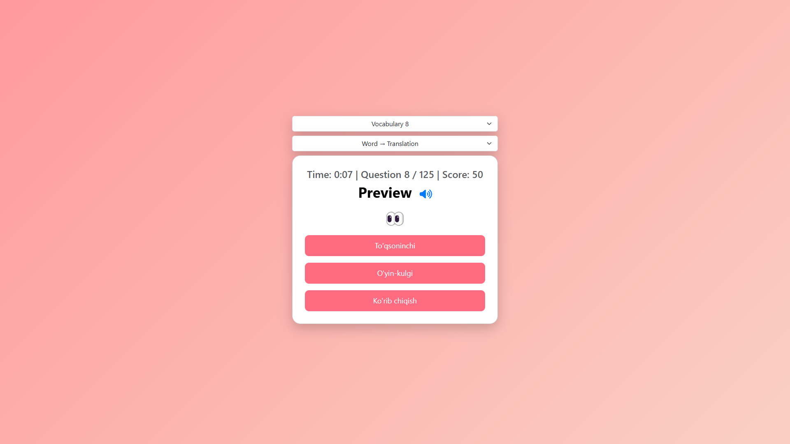

# 🏆 JavaScript Vocabulary Quiz 

A **fun and interactive vocabulary learning game** designed to help users improve their English skills!  
It features **AJAX-based dynamic questions**, **SweetAlert2 notifications**, and **text-to-speech support**.  



## 🚀 Features  

✔ **Multiple Vocabulary Levels** – Select different word lists 📚  
✔ **Two Learning Modes** – Word → Translation / Translation → Word 🔄  
✔ **Text-to-Speech** – Listen to correct pronunciations 🔊  
✔ **SweetAlert2 Notifications** – Engaging feedback after each answer 🎉  
✔ **Real-time Timer** – Keep track of your progress ⏳  
✔ **Bootstrap Responsive UI** – Clean and modern design 🎨  

---

## 🎯 How It Works  

1️⃣ Select a vocabulary level from the dropdown menu.  
2️⃣ Choose a learning mode (**Word → Translation** or **Translation → Word**).  
3️⃣ Answer questions by selecting the correct translation.  
4️⃣ Earn points for correct answers, but be careful—**5 mistakes reset the game!**  
5️⃣ Use the **speaker button** to hear the pronunciation.  


## 📂 Project Structure  

```
/project-root
│── /src/css/style.css         # Styling
│── /src/js/vocabulary8.json   # Vocabulary data
│── /src/js/vocabulary9.json   # Another vocabulary set
│── index.html                 # Main UI
│── README.md                  # Documentation
```

## 🔧 Setup & Installation  

1️⃣ **Clone the repository:**  
```bash
git clone https://github.com/Iqbolshoh/javascript-vocabulary-quiz.git
```

2️⃣ **Navigate to the project directory:**  
```bash
cd javascript-vocabulary-quiz
```

3️⃣ **Open `index.html` in your browser and start playing!** 🚀  

---

## 🖥 Technologies Used
<div style="display: flex; flex-wrap: wrap; gap: 5px;">
    
    
   
  
</div>

## 📜 License
This project is open-source and available under the **MIT License**.

## 🤝 Contributing  
🎯 Contributions are welcome! If you have suggestions or want to enhance the project, feel free to fork the repository and submit a pull request.

## 📬 Connect with Me  
💬 I love meeting new people and discussing tech, business, and creative ideas. Let’s connect! You can reach me on these platforms:

<div align="center">
  <table>
    <tr>
      <td>
        <a href="https://iqbolshoh.uz" target="_blank">
          
        </a>
      </td>
      <td>
        <a href="mailto:iilhomjonov777@gmail.com" target="_blank">
          
        </a>
      </td>
      <td>
        <a href="https://github.com/iqbolshoh" target="_blank">
          
        </a>
      </td>
      <td>
        <a href="https://www.linkedin.com/in/iqbolshoh/" target="_blank">
          
        </a>
      </td>
      <td>
        <a href="https://t.me/iqbolshoh_777" target="_blank">
          
        </a>
      </td>
      <td>
        <a href="https://wa.me/998997799333" target="_blank">
          
        </a>
      </td>
      <td>
        <a href="https://instagram.com/iqbolshoh_777" target="_blank">
          
        </a>
      </td>
      <td>
        <a href="https://x.com/iqbolshoh_777" target="_blank">
          
        </a>
      </td>
      <td>
        <a href="https://www.youtube.com/@Iqbolshoh_777" target="_blank">
          
        </a>
      </td>
    </tr>
  </table>
</div>
